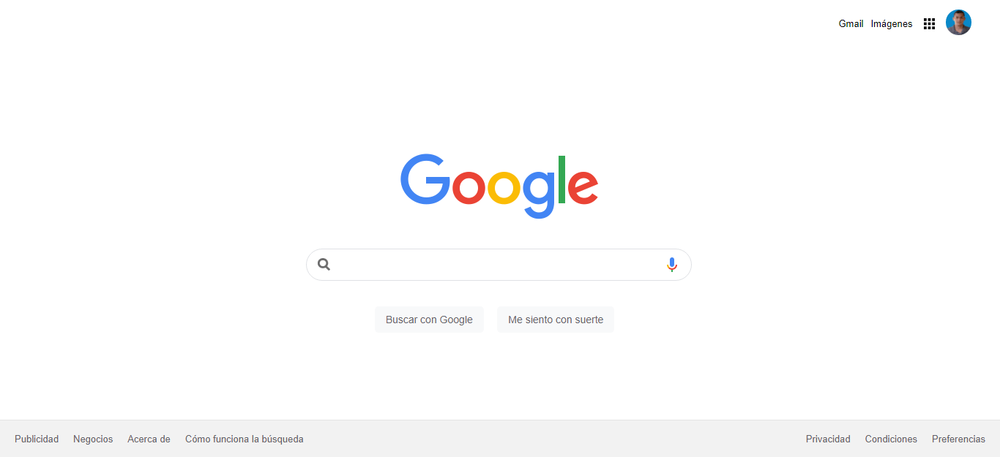

# Google Clone

Una simple maquetación (no funcional de la página principal de Google)

Tecnologías utilizadas: HTML, CSS, Git/Github

## Despliegue 📦

Pueder ver la página en esta url: https://dbriceno10.github.io/clon-de-google/

⌨️ con ❤️ por [dbriceno10](https://github.com/dbriceno10) 😊
